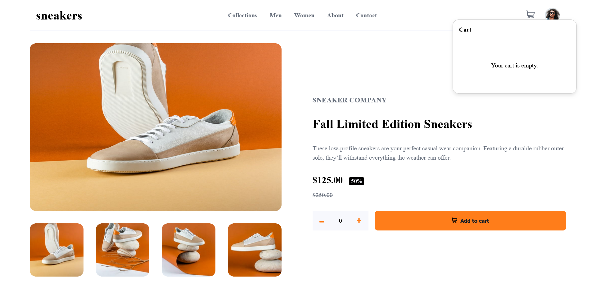
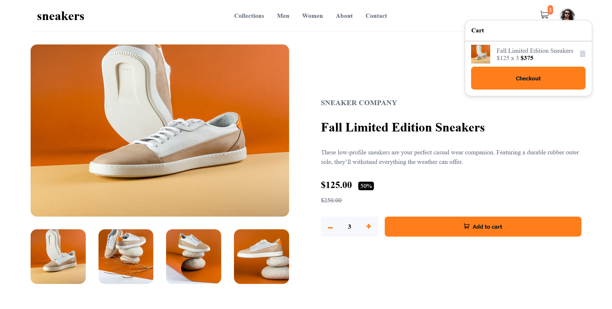
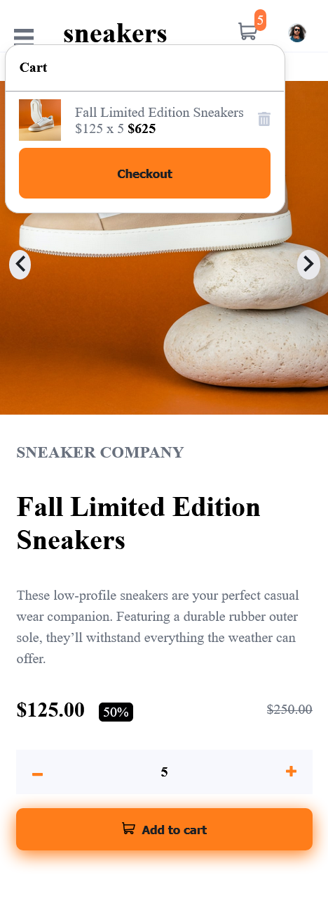

# Frontend Mentor - E-commerce product page

This is a solution to
the [E-commerce product page challenge on Frontend Mentor](https://www.frontendmentor.io/challenges/ecommerce-product-page-UPsZ9MJp6).
Frontend Mentor challenges help you improve your coding skills by building realistic projects.

## Table of contents

- [Overview](#overview)
    - [The challenge](#the-challenge)
    - [Screenshot](#screenshot)
    - [Links](#links)
- [My process](#my-process)
    - [Built with](#built-with)
    - [What I learned](#what-i-learned)
- [Author](#author)

## Overview

### The challenge

Users should be able to:

- View the optimal layout for the site depending on their device's screen size
- See hover states for all interactive elements on the page
- Open a lightbox gallery by clicking on the large product image
- Switch the large product image by clicking on the small thumbnail images
- Add items to the cart
- View the cart and remove items from it

### Screenshot


###### Cart empty (desktop)


###### Cart with item(desktop)


###### Mobile

### Links

- Solution URL: [Ecommerce Product Page](https://github.com/L-ux-es/Ecommerce-Product-Page)
- Live Site URL: [Frontend Mentor | Ecommerce Product Page solution](https://l-ux-es.github.io/Ecommerce-Product-Page/)

## My process

### Built with

- Semantic HTML5 markup
- CSS custom properties
- Flexbox
- Javascript

### What I learned

```html
       <div id="popup" class="popup">
            <div class="product-images-container popup-content">
                <button class="close-btn" onclick="closePopup()">X</button>
                
                <button class="left-control" onclick="previousImage('popupImage')" aria-label="Previous image">
                    
                </button>
                <button class="right-control" onclick="nextImage('popupImage')" aria-label="Next image">
                    ">
                </button>
                <div class="carrousel-product-images">
                    <button onclick=changePopupImage(this.firstElementChild,'images/image-product-1.jpg')>
                        
                    </button>
                    <button onclick=changePopupImage(this.firstElementChild,'images/image-product-2.jpg')>
                        
                    </button>
                    <button onclick=changePopupImage(this.firstElementChild,'images/image-product-3.jpg')>
                        
                    </button>
                    <button onclick=changePopupImage(this.firstElementChild,'images/image-product-4.jpg')>
                        
                    </button>
                </div>
            </div>
        </div>
```

```css
.popup {
    display: none;
    position: fixed;
    top: 0;
    left: 0;
    width: 100%;
    height: 100%;
    background-color: rgba(0, 0, 0, 0.7);
    justify-content: center;
    align-items: center;
}
```

## Author

- GitHub - [L-ux-es](https://github.com/L-ux-es)
- Frontend Mentor - [@L-ux-es](https://www.frontendmentor.io/profile/L-ux-es)
